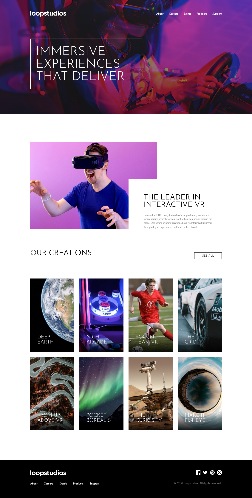

# Frontend Mentor - Loopstudios landing page solution

This is a solution to the [Loopstudios landing page challenge on Frontend Mentor](https://www.frontendmentor.io/challenges/loopstudios-landing-page-N88J5Onjw). Frontend Mentor challenges help you improve your coding skills by building realistic projects. 

You can preview the site [here]().

## Table of contents

- [Overview](#overview)
  - [The challenge](#the-challenge)
  - [Screenshot](#screenshot)
  - [Links](#links)
- [My process](#my-process)
  - [Built with](#built-with)
  - [What I learned](#what-i-learned)
  - [Useful resources](#useful-resources)
- [Author](#author)


## Overview

### The challenge

Users should be able to:

- View the optimal layout for the site depending on their device's screen size
- See hover states for all interactive elements on the page


### Screenshot




### Links

- Solution URL: [View my solution here](https://your-solution-url.com)
- Live Site URL: [Preview the site](https://your-live-site-url.com)

## My process

### Built with

- Semantic HTML5 markup
- CSS custom properties
- Flexbox
- CSS Grid
- Sass
- Javascript
- JQuery


### What I learned
- CSS Grid
- How to use a CSS preprocessor : Sass

```html
<div class="element"><!-- Content here--></h1>
```
```css
.element {
  display: grid;
}
```


### Useful resources
- [Dev Ed](https://www.youtube.com/channel/UClb90NQQcskPUGDIXsQEz5Q)
- [Angela Delise](https://www.youtube.com/channel/UC_TjoSnaI3CTgIgmSn3rruA)
- [W3Schools](https://www.w3schools.com/)
- [Stack Overflow](https://stackoverflow.com/)
- [MDN Docs](https://developer.mozilla.org/en-US/)


## Author

- Frontend Mentor - [@Josh-Ay](https://www.frontendmentor.io/profile/Josh-Ay)